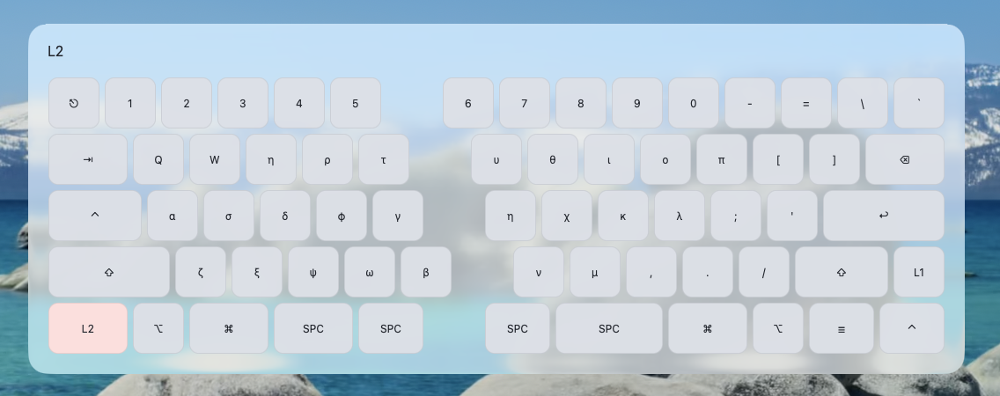

# QMK Keymap Overlay

[](https://github.com/sunaemon/keymap-overlay/actions/workflows/ci.yml?query=branch%3Amain)
[](LICENSE.md#tools-and-application-mit)
[](LICENSE.md#firmware-and-qmk-keymap-files-gpl-20-or-later)
[](#platform-support)
[](#project-status)

QMK Keymap Overlay shows the active momentary keyboard layer while its
`MO(...)` key is held. QMK firmware reports layer changes over Raw HID, and a
native overlay draws the matching keys, encoders, and labels on macOS, Linux,
or Windows.



## Project Status

> [!NOTE]
> This is beta software tested on the maintainer's systems. Compatibility and
> installation behavior may change before 1.0. See the
> [compatibility policy](docs/compatibility.md) and report problems through
> [GitHub Issues](https://github.com/sunaemon/keymap-overlay/issues).

## Choose Your Path

- [Install on macOS or Linux](#install-on-macos-or-linux)
  - [Finish setup on macOS](#finish-setup-on-macos)
  - [Finish setup on Linux](#finish-setup-on-linux)
  - [Enable GNOME](#gnome)
  - [Enable KDE Plasma or another desktop](#kde-plasma-and-other-desktops)
- [Install on Windows](#install-on-windows)
- [Update a keymap or the overlay](#everyday-operations)
- [Use a VIAL keymap](#vial-keymaps)
- [Add your own keyboard](docs/custom-keyboards.md)
- [Develop keymap-overlay](#development)

## How It Works

Installation has three parts:

1. Build QMK firmware that reports momentary layer changes over Raw HID.
2. Generate keyboard-specific **layer models (JSON)** from the source keymap.
3. Install the released native overlay and its login service.

Firmware and layer models come from this source checkout because they depend on
the keyboard files under `firmware/examples/`. The native overlay comes from GitHub
Releases, so a normal installation does not compile Rust locally. Release
archives contain the executable, MIT license, and third-party notices, but no
keyboard firmware or layer models.

See [docs/design.md](docs/design.md) for the Raw HID protocol, data flow, layer
composition rules, and native window design.

## Platform Support

|                | macOS                       | Linux                                   | Windows                       |
| -------------- | --------------------------- | --------------------------------------- | ----------------------------- |
| Renderer       | AppKit                      | GNOME Shell or Qt Quick                 | WPF                           |
| Autostart      | launchd                     | systemd user services + GNOME extension | current-user Run registry key |
| Raw HID access | Input Monitoring permission | `uaccess` udev rule                     | no additional permission      |
| Firmware tools | source checkout             | source checkout                         | source checkout in WSL        |
| Overlay binary | GitHub Release              | GitHub Release                          | GitHub Release                |

GNOME 45 or newer uses the included Shell extension on Wayland or X11. Other
desktops use the Qt renderer on both display protocols. On Wayland,
LayerShellQt provides the required overlay semantics; on X11, the renderer uses
a native Qt/XCB window. The maintainer has tested GNOME/Wayland, KDE
Plasma/Wayland, Sway/Wayland, and Cinnamon/X11. Other combinations are
supported by their respective renderer but are not part of the regularly
tested matrix. Cinnamon does not load the GNOME extension.

### Bundled keyboards

| ID  | QMK keyboard                 | `QK_BOOT` binding                           |
| --- | ---------------------------- | ------------------------------------------- |
| `1` | `salicylic_acid3/insixty_en` | hold `L1` (right of `RSFT`), then press `Q` |
| `2` | `doio/kb16/rev2`             | hold `MO(3)` (bottom left), then press `1`  |

Each directory under `firmware/examples/` is named with its `KEYBOARD_ID`. The ID is
compiled into firmware and used as the layer-model filename prefix; it must be
an integer from 0 through 255. Other keyboards require a small configuration;
see [Custom Keyboard Configuration](docs/custom-keyboards.md).

If the installed firmware cannot enter the bootloader:

- **insixty_en:** hold the top-left key while connecting USB. Copy the built
  `.uf2` to the mounted `RPI-RP2` volume, flashing each half separately. See
  the [build guide](https://salicylic-acid3.hatenablog.com/entry/in60en-build-guide#Tips%E3%83%95%E3%82%A1%E3%83%BC%E3%83%A0%E3%82%A6%E3%82%A7%E3%82%A2%E3%82%92%E6%9B%B8%E3%81%8D%E6%8F%9B%E3%81%88%E3%82%8B).
- **doio/kb16/rev2:** hold `1!` while connecting USB, or press the reset button
  on the back. See the
  [QMK keyboard README](https://github.com/qmk/qmk_firmware/tree/master/keyboards/doio/kb16/rev2#bootloader).

## Install on macOS or Linux

### 1. Prepare the source checkout

```bash
git clone https://github.com/sunaemon/keymap-overlay.git
cd keymap-overlay
curl https://mise.run | sh
```

See [Installing mise](https://mise.jdx.dev/installing-mise.html) for package
manager alternatives. Start a new shell if `mise` is not yet on `PATH`, then
install the pinned tools and QMK toolchain:

```bash
make setup
```

`make setup` initializes Vial QMK shallowly and downloads only ChibiOS, LUFA,
and the Pico SDK, which are the nested firmware dependencies used by the
tracked STM32F103 and RP2040 keyboards. A keyboard with an unknown processor
produces a warning and falls back to initializing every nested submodule.
The firmware submodule opts out of Git's automatic updates, so cloning with
`--recurse-submodules` is also safe: Git skips firmware until `make setup`
selects its dependencies.

On Linux, `make setup` supports `pacman`, `apt-get`, and `dnf` and may request
`sudo` while installing system packages. Ubuntu 24.04 does not provide
`qml6-module-org-kde-layershell`; KDE users need a Qt 6 LayerShellQt package
from a newer distribution or backport. GNOME does not need LayerShellQt.

### 2. Build and flash firmware

Choose an ID from [Bundled keyboards](#bundled-keyboards):

```bash
make flash KEYBOARD_ID=1
```

`make flash` waits for the keyboard bootloader. On Linux, the Makefile mounts
an rp2040 `RPI-RP2` volume at `/run/media/$USER/RPI-RP2`; set `SUDO=` if the
desktop already mounts it, or set `UF2_VOLUME_LABEL` for another label.

### 3. Generate and install layer models

```bash
make install-assets
```

This installs one file per keyboard, such as `1.json`, under
`~/.cache/keymap-overlay`. Run it again whenever the keymap changes.

### 4. Install the released overlay

```bash
curl -fsSL \
  https://github.com/sunaemon/keymap-overlay/releases/latest/download/install.sh \
  -o install.sh
less install.sh
sh install.sh
```

Review the script before leaving `less` with `q`. It selects the release for
the current system, verifies its SHA-256 checksum, installs the executable,
registers login services, and starts them. When authenticated GitHub CLI is
available, it also verifies the artifact attestation.

On macOS and Linux the executable is installed to `~/.local/bin/keymap-overlay`,
with the Qt renderer beside it, while the generated layer models stay in
`~/.cache/keymap-overlay`. The login service names the binary by absolute path,
so it works whether or not `~/.local/bin` is on your `PATH`; drop the directory
prefix below once it is. Its license terms are built in:

```bash
~/.local/bin/keymap-overlay --license                 # this project's terms
~/.local/bin/keymap-overlay --third-party-licenses    # third-party notices
```

### Finish setup on macOS

Grant the overlay Input Monitoring permission in System Settings when
prompted. The overlay then appears whenever a QMK `MO(...)` key is held.

### Finish setup on Linux

Grant Raw HID access, then reconnect keyboards that are already plugged in:

```bash
make install-udev-rules
```

The installer provides both Linux renderers. Complete only the subsection for
your desktop.

#### GNOME

Log out and back in once so GNOME discovers the extension, then run:

```bash
gnome-extensions enable keymap-overlay@sunaemon
systemctl --user restart keymap-overlay.service
```

#### KDE Plasma, Cinnamon, and other desktops

The installer normally enables the Qt renderer automatically. To enable it
manually and start its shared HID daemon:

```bash
systemctl --user enable --now keymap-overlay.service keymap-overlay-qt.service
```

Cinnamon uses this Qt renderer rather than the GNOME Shell extension. It works
in a Cinnamon/X11 session through Qt's XCB backend; LayerShellQt is needed only
for supported Wayland sessions. If the service was already running under a
different desktop session, restart both processes after logging in so they
inherit Cinnamon's current `DISPLAY` and D-Bus environment:

```bash
systemctl --user restart keymap-overlay.service keymap-overlay-qt.service
```

Sway's default configuration imports its Wayland environment into the systemd
user manager but does not start `graphical-session.target`. The enabled overlay
services therefore remain inactive. Start them explicitly after entering a
Sway session:

```bash
systemctl --user start keymap-overlay.service keymap-overlay-qt.service
```

If the daemon was still acquiring its D-Bus name when the renderer started,
restart the renderer once:

```bash
systemctl --user restart keymap-overlay-qt.service
```

## Install on Windows

Windows uses two environments:

- **WSL `keymap-firmware`** builds and flashes QMK firmware and generates layer
  models.
- **PowerShell** installs and runs the released native overlay.

MSYS2 and Visual Studio Build Tools are needed only for development.

Install Windows Terminal first, in an administrator PowerShell:

```powershell
winget install --interactive --exact --source winget Microsoft.WindowsTerminal
```

### 1. Prepare WSL

In an administrator PowerShell:

```powershell
winget install --interactive --exact --source winget dorssel.usbipd-win
wsl.exe --install --no-distribution
```

Restart if requested. In a new administrator PowerShell:

```powershell
wsl --update
wsl --install -d Ubuntu --name keymap-firmware
```

Restart if requested. In the new Ubuntu environment:

```bash
sudo apt-get update
sudo apt-get install --yes build-essential curl git usbutils
curl https://mise.run/bash | sh
exec bash
git clone https://github.com/sunaemon/keymap-overlay.git
cd keymap-overlay
make setup
sudo groupadd --force qmk
sudo usermod --append --groups qmk "$USER"
sed 's/TAG+="uaccess"/GROUP="qmk", MODE="0660"/' firmware/vendor/vial-qmk/util/udev/50-qmk.rules |
  sudo tee /etc/udev/rules.d/50-qmk-wsl.rules >/dev/null
sudo udevadm control --reload
newgrp qmk
```

Keep the checkout in the WSL home directory. The dedicated `qmk` group replaces
QMK's normal desktop-seat `uaccess` rule inside WSL. If no udev control socket
exists, run `sudo service udev restart` instead.

### 2. Attach and flash the bootloader

Enter the keyboard bootloader. In an administrator PowerShell, identify the
new bootloader entry—not the normal keyboard—and attach it to WSL:

```powershell
usbipd list
usbipd bind --busid <BUSID>
usbipd attach --wsl --busid <BUSID>
```

Keep a WSL terminal open, then flash from the checkout:

```bash
lsusb
make flash KEYBOARD_ID=1
```

After the bootloader resets, return it to Windows:

```powershell
usbipd detach --busid <BUSID>
```

Sharing persists, but attachment must be repeated after a disconnect. If
USBPcap is installed, `usbipd bind` may require `--force`; use it only for the
bootloader entry. For rp2040, copying the built `.uf2` to `RPI-RP2` in Explorer
is a simpler fallback.

### 3. Install layer models into the Windows profile

From WSL:

```bash
WINDOWS_LOCAL="$(cd /mnt/c && cmd.exe /C echo %LOCALAPPDATA% | tr -d '\r')"
WINDOWS_LOCAL_APP_DATA="$(wslpath "$WINDOWS_LOCAL")"
make install-assets \
  OVERLAY_PLATFORM=windows \
  KEYMAP_OVERLAY_DIR="$WINDOWS_LOCAL_APP_DATA/keymap-overlay"
```

Run this again whenever the keymap changes.

### 4. Install the released Windows overlay

In a non-administrator PowerShell:

```powershell
Invoke-WebRequest `
  -Uri 'https://github.com/sunaemon/keymap-overlay/releases/latest/download/install.ps1' `
  -OutFile install.ps1 `
  -ErrorAction Stop
Get-Content -LiteralPath install.ps1
powershell.exe -ExecutionPolicy Bypass -File install.ps1
```

Review the script before running the final command. It verifies the release,
installs the executable under `%LOCALAPPDATA%\Programs\keymap-overlay` and the
layer models under `%LOCALAPPDATA%\keymap-overlay`, registers the current
user's `KeymapOverlay` Run value, and starts the overlay.

## Everyday Operations

### Update a keymap

Edit `keymap.c`, flash it, then render the layer models from the connected
keyboard:

```bash
git pull
make setup-firmware
make flash KEYBOARD_ID=<keyboard-id>
make flash-keymap KEYBOARD_ID=<keyboard-id>
make install-assets KEYBOARD_ID=<keyboard-id>
```

To render directly from the edited source without updating EEPROM, use
`make install-assets VIAL=false KEYBOARD_ID=<keyboard-id>` instead.

On Windows, use WSL and the Windows-profile arguments from the installation
section. Restart the runtime after installing new models:

```bash
# macOS
launchctl kickstart -k "gui/$(id -u)/com.sunaemon.keymap-overlay"

# Linux daemon
systemctl --user restart keymap-overlay.service

# Linux Qt renderer, when used
systemctl --user restart keymap-overlay-qt.service
```

On Windows PowerShell:

```powershell
Get-Process keymap-overlay -ErrorAction SilentlyContinue | Stop-Process
$models = "$env:LOCALAPPDATA\keymap-overlay"
$exe = "$env:LOCALAPPDATA\Programs\keymap-overlay\keymap-overlay.exe"
Start-Process $exe -ArgumentList "--asset-dir", "`"$models`""
```

### Upgrade the released overlay

```bash
# macOS or Linux
sh ~/.config/keymap-overlay/install.sh
```

```powershell
# Windows
powershell.exe -ExecutionPolicy Bypass -File "$env:LOCALAPPDATA\keymap-overlay\install.ps1"
```

### Logs and quick checks

Where the log goes depends on what supervises the overlay:

| System  | Log                                                |
| ------- | -------------------------------------------------- |
| Linux   | the journal, `journalctl --user -u keymap-overlay` |
| macOS   | `~/.local/var/log/keymap-overlay/overlay.log`      |
| Windows | `%LOCALAPPDATA%\keymap-overlay\logs\overlay.log`   |

A log the overlay writes itself rotates at 1 MiB and retains the current file
plus three previous files; journald applies its own retention instead.

On Linux:

```bash
systemctl --user status keymap-overlay.service
systemctl --user status keymap-overlay-qt.service
journalctl --user -u keymap-overlay.service -f
```

On macOS:

```bash
tail -f ~/.local/var/log/keymap-overlay/overlay.log
```

### Uninstall

```bash
# macOS or Linux
sh ~/.config/keymap-overlay/install.sh --uninstall
```

```powershell
# Windows
powershell.exe -ExecutionPolicy Bypass -File "$env:LOCALAPPDATA\keymap-overlay\install.ps1" -Uninstall
```

Uninstalling removes the executable, license notices, and login entry. Layer
models and rotated logs are retained.

## VIAL Keymaps

By default, `make install-assets` and `make draw-layers` read the keymap
currently stored in the connected keyboard's VIAL EEPROM — including edits
made live in the Vial app, not just what `keymap.c` last compiled to. To
render straight from `keymap.c` instead, with no keyboard connected:

```bash
make install-assets VIAL=false
```

Parse `keymap.c` and write it to EEPROM without rebuilding firmware:

```bash
make flash-keymap
```

`flash-keymap` preserves `KC_TRNS`, so transparent keys continue to inherit
lower layers.

## Custom Keyboard Configuration

To add a keyboard, place encoder geometry, custom labels, and keymap source in
an external configuration directory or a fork. The complete workflow is in
[docs/custom-keyboards.md](docs/custom-keyboards.md).

## Development

Normal users can stop above. This section is for changing the Rust overlay,
Python generators, Makefile, or installers.

### macOS and Linux

After completing the source setup from the installation section:

```bash
make test
make test-rust
make build-overlay
make install-overlay
```

`make install-overlay` exercises the source-built installation path. Use
`make run-overlay` for a foreground UI session.

On macOS, `make test-release-acceptance-macos` tests installer upgrades and
rollback, then drives simulated layer events through the native AppKit overlay
and verifies two show cycles with the hidden transition between them.

On Linux, `make test-release-acceptance-linux` is the equivalent release
go/no-go check. It tests installer upgrades and rollback, then runs two E2E
halves around the project-owned D-Bus contract. The HID-to-D-Bus half creates a
virtual device through `/dev/uhid`, sends Raw HID layer reports through the
kernel `hidraw` path, and asserts the daemon's public state. The
D-Bus-to-renderer half exercises the daemon and Qt renderer together, including
a golden-image comparison of the rendered Qt Quick overlay. The HID half
requires the `uhid` kernel module.

To exercise the complete native overlay without a physical keyboard, name a
generated keyboard and momentary layer:

```bash
make run-overlay SIMULATE=1:2
```

This shows keyboard 1 layer 2 for two seconds, hides it for one second, and
repeats until interrupted. Simulation replaces Raw HID input for that process,
so it also works on a machine with no supported keyboard attached. The models
must already have been generated and installed with `make install-assets`.

### Windows with MSYS2 UCRT64

Develop the native Windows overlay in MSYS2 UCRT64, not WSL. In PowerShell:

```powershell
winget install --id MSYS2.MSYS2 -e --source winget
winget install --id jdx.mise -e --source winget
winget install --id Microsoft.VisualStudio.2022.BuildTools -e --source winget --override "--wait --passive --add Microsoft.VisualStudio.Workload.VCTools --add Microsoft.VisualStudio.Component.VC.Tools.ARM64 --includeRecommended"
```

WinGet normally exposes `mise.exe` through
`%LOCALAPPDATA%\Microsoft\WinGet\Links`. If `mise` is not found after opening a
new terminal, add that directory to the user `PATH` from PowerShell, then close
and reopen Windows Terminal (and any editor or Codex process that launches
builds):

```powershell
$miseBin = "$env:LOCALAPPDATA\Microsoft\WinGet\Links"
$userPath = [Environment]::GetEnvironmentVariable("Path", "User")
if (($userPath -split ";") -notcontains $miseBin) {
    $updatedPath = if ([string]::IsNullOrWhiteSpace($userPath)) {
        $miseBin
    } else {
        $userPath.TrimEnd(";") + ";" + $miseBin
    }
    [Environment]::SetEnvironmentVariable(
        "Path",
        $updatedPath,
        "User"
    )
}
```

Open the architecture-matching Visual Studio developer command prompt (`ARM64
Native Tools Command Prompt for VS 2022` on Windows on Arm, or `x64 Native
Tools Command Prompt for VS 2022` on x64), then start UCRT64 from it so the
MSVC linker and Windows SDK environment are inherited:

```bat
C:\msys64\msys2_shell.cmd -defterm -here -no-start -ucrt64 -use-full-path
```

In UCRT64, `type -a link` must list Visual Studio's architecture-matching
`link.exe` before MSYS2's `/usr/bin/link`; Rust needs the former.

In that shell:

```bash
pacman -Syu
# Reopen the shell if requested, then:
pacman -Syu
pacman -S --needed mingw-w64-ucrt-x86_64-git make
WINDOWS_HOME="$(cygpath -u "$USERPROFILE")"
cd "$WINDOWS_HOME"
git -c core.autocrlf=false clone https://github.com/sunaemon/keymap-overlay.git
cd keymap-overlay
make setup
command -v mise
mise exec -- dotnet --info
make test
make test-rust
make test-release-acceptance-windows
make install-overlay
```

The native build follows the host architecture: x64 produces a `win-x64` WPF
executable and x64 Rust bridge, while Windows on Arm produces `win-arm64` for
both. Confirm that Rust and .NET agree before building:

```bash
mise exec -- rustc -vV | grep '^host:'
mise exec -- dotnet --info | grep 'RID:'
```

The pairs must be `x86_64-pc-windows-msvc` with `win-x64`, or
`aarch64-pc-windows-msvc` with `win-arm64`. The Visual Studio install command
above includes both x64 and ARM64 C++ tools so either native build has the MSVC
linker and Windows SDK it needs.

`make install-overlay` expects layer models already generated into the Windows
profile by WSL. Firmware and asset targets intentionally stop in MSYS2.

After changing the Windows bridge, also run:

```bash
cargo clippy --manifest-path overlay/platforms/windows/bridge/Cargo.toml -- -D warnings
```

### Verification

```bash
make format
make lint
make test
make test-rust
make build-overlay
make test-release-acceptance-macos # macOS only: installer rollback + AppKit E2E
make test-release-acceptance-linux # Linux only: installer rollback + both E2E halves
make audit
make test-installer-sh
```

Windows release acceptance runs the `install.ps1` Pester suite and the WPF E2E
test, which checks visible, hidden, and visible-again presentation states using
simulated layer events. Verify manually that the overlay never takes focus:
type into an editor while repeatedly holding a layer key and confirm every
keystroke remains in the editor.

See [CONTRIBUTING.md](CONTRIBUTING.md) for contribution expectations and
[docs/releasing.md](docs/releasing.md) for the release checklist.

## License

Firmware under `firmware/` and keyboard files under `firmware/examples/` are
GPL-2.0-or-later. The tools and application are MIT licensed. See
[LICENSE.md](LICENSE.md), [firmware/examples/LICENSE](firmware/examples/LICENSE), and the generated
[third-party license notices](THIRD-PARTY-LICENSES.html).

The installed overlay embeds the first and the last of those, so a binary copied
away from its install directory can still state its terms: run
`keymap-overlay --license` or `keymap-overlay --third-party-licenses`. Both files also
remain in every release archive for downstream packaging.
