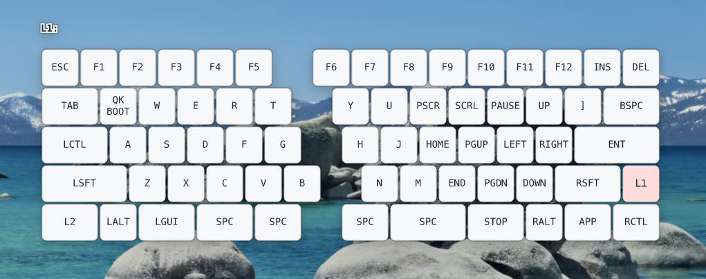

# QMK Keymap Overlay

[](https://github.com/sunaemon/keymap-overlay/actions/workflows/ci.yml?query=branch%3Amain)
[](LICENSE.md#tools-and-application-mit)
[](LICENSE.md#firmware-and-qmk-keymap-files-gpl-20-or-later)
[](#platform-support)
[](#project-status)

This project builds QMK firmware that reports momentary layer changes over Raw
HID, generates one display asset for each keymap layer, and displays the active
layer in a native overlay on macOS, Linux, and Windows. All three systems
install semantic JSON, compose held layers with QMK precedence, and draw every
key, encoder, and label with AppKit, GNOME Shell, Qt Quick, or WPF.



See [doc/design.md](doc/design.md) for the protocol, data flow, and windowing
design.

## Project Status

keymap-overlay is **beta software, tested on the maintainer's systems**. The
core workflow is usable, but compatibility and installation behavior may still
change before 1.0. Please report problems through
[GitHub Issues](https://github.com/sunaemon/keymap-overlay/issues); see
[the compatibility policy](doc/compatibility.md) for the currently tested
platforms and stability guarantees.

## How Installation Is Split

The normal workflow deliberately uses two distribution models:

- **Firmware and layer assets come from the source checkout.** Keep the
  checkout because `make flash`, `make flash-keymap`, and
  `make install-assets` depend on the keyboard-specific files in `example/`
  and the vendored `qmk_firmware` submodule.
- **The overlay application comes from GitHub Releases.** `install.sh` or
  `install.ps1` downloads the latest native binary and registers it to start at
  login. A normal installation does not compile the Rust overlay locally.

Each release archive contains the overlay executable, the MIT license, and
third-party license notices. It does not contain firmware or keyboard-specific
assets.

This repository currently includes configurations for
`salicylic_acid3/insixty_en` and `doio/kb16/rev2`. Each directory under
`example/` is named with its `KEYBOARD_ID`. The ID is compiled into the
firmware, sent in the Raw HID report, and used as the asset filename prefix, so it
must be an integer from 0 through 255.

## Platform Support

|                | macOS                                   | Linux                                           | Windows                       |
| -------------- | --------------------------------------- | ----------------------------------------------- | ----------------------------- |
| Overlay window | Native AppKit glass, controls, and text | GNOME Shell or Qt Quick with KDE LayerShellQt   | Native WPF                    |
| Autostart      | launchd agent                           | systemd user services + GNOME extension         | current-user Run registry key |
| Raw HID access | Input Monitoring permission             | `uaccess` udev rule (`make install-udev-rules`) | nothing to grant              |
| Firmware tools | source checkout on macOS                | source checkout on Linux                        | source checkout in WSL        |
| Overlay binary | GitHub Release                          | GitHub Release                                  | GitHub Release                |

Linux runs one Rust HID daemon and publishes its final display state over the
user's D-Bus session. GNOME 45+ renders that state through the included Shell
extension on Wayland or X11, so the overlay follows GNOME's light/dark theme.
KDE Plasma uses the Qt renderer as its preferred native integration:
LayerShellQt supplies Wayland overlay semantics, and Qt also supports X11.
Other non-GNOME desktops can use the same renderer. Cinnamon does not load
GNOME extensions, but it can use the Qt renderer today and a future Cinnamon
Spice can reuse the same D-Bus protocol.

## Enter the Keyboard Bootloader

Both example keymaps include `QK_BOOT`:

| Keyboard             | `QK_BOOT` binding                              |
| -------------------- | ---------------------------------------------- |
| `1` (insixty_en)     | hold the `L1` key (right of `RSFT`), press `Q` |
| `2` (doio/kb16/rev2) | hold the `MO(3)` key (bottom left), press `1`  |

If the installed firmware cannot enter the bootloader:

- **insixty_en:** hold the top-left key while connecting USB. Copy the built
  `.uf2` to the mounted `RPI-RP2` volume, flashing each half separately. See
  the [build guide](https://salicylic-acid3.hatenablog.com/entry/in60en-build-guide#Tips%E3%83%95%E3%82%A1%E3%83%BC%E3%83%A0%E3%82%A6%E3%82%A7%E3%82%A2%E3%82%92%E6%9B%B8%E3%81%8D%E6%8F%9B%E3%81%88%E3%82%8B).
- **doio/kb16/rev2:** hold the `1!` key while connecting USB, or press the
  reset button on the back. See the
  [QMK keyboard README](https://github.com/qmk/qmk_firmware/tree/master/keyboards/doio/kb16/rev2#bootloader).

## Install on macOS or Linux

These steps build and flash the keyboard firmware from source, generate the
layer assets, and install the latest released overlay binary.

### 1. Clone the firmware and asset sources

```bash
git clone --recurse-submodules https://github.com/sunaemon/keymap-overlay.git
cd keymap-overlay
```

Install mise with its official installer:

```bash
curl https://mise.run | sh
```

See [Installing mise](https://mise.jdx.dev/installing-mise.html) for package
manager and other installation methods. Start a new shell if `mise` is not yet
available on `PATH`.

Install the pinned tools and QMK toolchain:

```bash
make setup
```

The setup target runs `mise trust` before installing the pinned tools.

On Linux, `make setup` supports `pacman`, `apt-get`, and `dnf` and may ask for
the sudo password while installing system packages. On Debian-based systems,
the Qt 6 LayerShellQt QML module is installed automatically when the
distribution provides `qml6-module-org-kde-layershell`; Ubuntu 24.04 does not
ship that package, so KDE Plasma users on that release must install a Qt 6
LayerShellQt package from a newer distribution or backport before running the
Qt renderer. GNOME uses the included Shell extension instead.

### 2. Build and flash the firmware

```bash
make flash KEYBOARD_ID=1
```

`make flash` compiles the firmware and waits for the keyboard to enter its
bootloader. Use the applicable method under
[Enter the Keyboard Bootloader](#enter-the-keyboard-bootloader).

On Linux, the Makefile mounts an rp2040 `RPI-RP2` volume at
`/run/media/$USER/RPI-RP2` before QMK deploys the `.uf2`. Set `SUDO=` if the
desktop already mounts it, or set `UF2_VOLUME_LABEL` for another volume label.

### 3. Generate the layer assets

```bash
make install-assets
```

Run this again after changing the keymap. It installs JSON models such as
`1_L1.json` under `~/.config/keymap-overlay`; the native overlay renders their
keys, encoders, and text directly with AppKit, GNOME Shell, Qt Quick, or WPF.

On Linux, also grant the logged-in user access to the Raw HID interfaces and
reconnect any keyboard that was already plugged in:

```bash
make install-udev-rules
```

On macOS, grant the overlay Input Monitoring permission in System Settings
when prompted.

### 4. Install the latest overlay release

```bash
curl -fsSL \
  https://github.com/sunaemon/keymap-overlay/releases/latest/download/install.sh \
  -o install.sh
less install.sh
sh install.sh
```

Review the downloaded script before leaving `less` with `q`. The installer then
selects the release for the current OS and architecture, downloads it from an
immutable versioned release URL, verifies the required SHA-256 checksum,
installs the executable and license notices, registers the launchd agent or
systemd user services, and starts them. If GitHub CLI (`gh`) is available and
authenticated, it also verifies GitHub's artifact attestations; `gh` is
optional.
On Linux it also installs the GNOME Shell and Qt renderers. GNOME selects its
Shell extension, while KDE Plasma and other non-GNOME desktops select Qt.
The installer prints every installed path when complete. Logs are written to
`~/.local/var/log/keymap-overlay/overlay.log` and rotate at 1 MiB, retaining the
current file and three previous files.

Run `sh ~/.config/keymap-overlay/install.sh` to upgrade to the latest release.

### 5. Enable the overlay on GNOME

After the first installation, log out and back in so GNOME discovers the newly
installed extension. Then enable the extension and restart the HID daemon:

```bash
gnome-extensions enable keymap-overlay@sunaemon
systemctl --user restart keymap-overlay.service
```

The overlay appears while a QMK `MO(...)` layer key is held. The separate Qt
renderer is used automatically outside GNOME.

### 6. Enable the overlay on KDE Plasma

The installer normally enables the Qt renderer automatically. To enable it
manually and start it immediately, run:

```bash
systemctl --user enable --now keymap-overlay-qt.service
```

The Qt service starts the shared HID daemon through its systemd dependency.
Qt is the preferred KDE renderer on both Wayland and X11; the GNOME extension
does not need to be enabled.

## Install on Windows

The normal Windows workflow uses two environments:

- **WSL `keymap-firmware`** holds the source checkout, builds and flashes QMK
  firmware, and generates JSON models for the native overlay.
- **PowerShell** installs and runs the released native Windows overlay.

MSYS2 and Visual Studio Build Tools are not required unless developing the
Windows overlay itself; that setup is documented under
[Getting Started for Development](#getting-started-for-development).

### 1. Set up the firmware environment in WSL

Open an administrator PowerShell:

```powershell
winget install --interactive --exact dorssel.usbipd-win
wsl --update
wsl --install -d Ubuntu --name keymap-firmware
```

Restart Windows if requested, open Ubuntu, create its Linux user, and install
the base tools and mise:

```bash
sudo apt-get update
sudo apt-get install --yes build-essential curl git usbutils
curl https://mise.run/bash | sh
exec bash
```

Clone the source inside WSL's Linux filesystem and install the QMK and image
generation tools:

```bash
git clone --recurse-submodules https://github.com/sunaemon/keymap-overlay.git
cd keymap-overlay
make setup
sudo groupadd --force qmk
sudo usermod --append --groups qmk "$USER"
sed 's/TAG+="uaccess"/GROUP="qmk", MODE="0660"/' qmk_firmware/util/udev/50-qmk.rules |
  sudo tee /etc/udev/rules.d/50-qmk-wsl.rules >/dev/null
sudo udevadm control --reload
newgrp qmk
```

Keeping this checkout under the WSL home directory avoids Windows filesystem
performance and Python virtual-environment compatibility problems.

The WSL rule derives from QMK's supported bootloader list but grants read/write
access only to members of the dedicated `qmk` group, because WSL has no desktop
login seat for QMK's usual `uaccess` tags. This covers devices such as the
STM32duino `1eaf:0003` bootloader. Install and reload the rule before attaching
the bootloader to WSL. `newgrp qmk` applies the new membership to the current
shell; future shells inherit it automatically. If reloading reports that no
udev control socket exists, run `sudo service udev restart` instead.

### 2. Build and flash the firmware from WSL

Keep the keyboard attached to Windows during normal use, then follow this order:

1. Use the applicable method under
   [Enter the Keyboard Bootloader](#enter-the-keyboard-bootloader). The
   bootloader enumerates as a new USB device distinct from the normal keyboard.
2. In an administrator PowerShell, run `usbipd list` and find the new entry
   that appeared after entering the bootloader. Use that entry's BUSID for
   both `bind` and `attach`:

```powershell
usbipd list
usbipd bind --busid <BUSID>
usbipd attach --wsl --busid <BUSID>
```

Do not bind the normal keyboard entry. Sharing persists for the bootloader
device, while attaching must be repeated whenever the bootloader disconnects
or resets. Keep a WSL terminal open while attaching.

Then flash from the WSL checkout:

```bash
lsusb
make flash KEYBOARD_ID=1
```

Finish the WSL-side connection according to the bootloader:

- **STM32duino:** detach the bootloader from an administrator PowerShell so
  Windows can use the keyboard again:

  ```powershell
  usbipd detach --busid <BUSID>
  ```

- **rp2040 (`RPI-RP2`):** `make flash` automatically unmounts the volume after
  copying the `.uf2`. Then detach the USB device from an administrator
  PowerShell:

  ```powershell
  usbipd detach --busid <BUSID>
  ```

If USBPcap is installed, `usbipd` may require
`usbipd bind --force --busid <BUSID>`. Apply that only to the bootloader entry,
not the normal keyboard. For an rp2040 bootloader, building in WSL and copying
the resulting `.uf2` to `RPI-RP2` in Explorer is also a simple fallback.

### 3. Generate images into the Windows profile

From the WSL checkout:

```bash
WINDOWS_PROFILE="$(cd /mnt/c && cmd.exe /C echo %USERPROFILE% | tr -d '\r')"
WINDOWS_HOME="$(wslpath "$WINDOWS_PROFILE")"
make install-assets \
  OVERLAY_PLATFORM=windows \
  KEYMAP_OVERLAY_DIR="$WINDOWS_HOME/.config/keymap-overlay"
```

Running `cmd.exe` from `/mnt/c` avoids its warning that the WSL checkout's UNC
path cannot be used as a CMD working directory.

Run this again after changing the keymap.

### 4. Install the latest Windows overlay release

Download and inspect `install.ps1` from PowerShell:

```powershell
Invoke-WebRequest `
  -Uri 'https://github.com/sunaemon/keymap-overlay/releases/latest/download/install.ps1' `
  -OutFile install.ps1 `
  -ErrorAction Stop
Get-Content -LiteralPath install.ps1
powershell.exe -ExecutionPolicy Bypass -File install.ps1
```

Review the downloaded script before running the final command. The installer
downloads the Windows x86_64 release, installs it under
`%USERPROFILE%\.config\keymap-overlay`, registers the current user's
`KeymapOverlay` Run value, starts the overlay, and prints every installed
location. The SHA-256 checksum is always verified; when optional GitHub CLI is
installed and authenticated, the attestation is verified too. No administrator
PowerShell is needed for this step.

To upgrade later, run the installer saved during installation:

```powershell
powershell.exe -ExecutionPolicy Bypass -File "$env:USERPROFILE\.config\keymap-overlay\install.ps1"
```

## Uninstalling the Released Overlay

On macOS or Linux:

```bash
sh ~/.config/keymap-overlay/install.sh --uninstall
```

On Windows:

```powershell
powershell.exe -ExecutionPolicy Bypass -File "$env:USERPROFILE\.config\keymap-overlay\install.ps1" -Uninstall
```

Uninstalling stops and removes the overlay executable, installed license
notices, and login entry. Generated layer assets and rotated logs are retained so
they can be reused after reinstalling or inspected for troubleshooting.

## Updating a Keymap

The source checkout remains the authority for firmware and display assets:

```bash
git pull --recurse-submodules
git submodule update --init --recursive
make flash KEYBOARD_ID=<keyboard-id>
make install-assets
```

On Windows, use the WSL `KEYMAP_OVERLAY_DIR` argument shown above. Restart the
overlay after flashing so it reconnects immediately:

```bash
# macOS
launchctl kickstart -k "gui/$(id -u)/com.sunaemon.keymap-overlay"

# Linux
systemctl --user restart keymap-overlay.service
```

On Windows PowerShell:

```powershell
Get-Process keymap-overlay -ErrorAction SilentlyContinue | Stop-Process
$overlay = "$env:USERPROFILE\.config\keymap-overlay"
Start-Process "$overlay\keymap-overlay.exe" -ArgumentList "`"$overlay`""
```

## VIAL Keymaps

For a keyboard running VIAL-enabled firmware, generate display assets from the keymap
currently stored in EEPROM:

```bash
make install-assets VIAL=true
```

To parse `keymap.c` and write the result to EEPROM without rebuilding the
firmware:

```bash
make flash-keymap
```

`flash-keymap` preserves `KC_TRNS` on the device-writing path so transparent
keys continue to inherit lower layers.

## Managing Custom Keyboard Configuration

If you want to change and version your keyboard-specific configuration, you can
fork this repository. Keeping it as an unmodified submodule and storing your
configuration beside it is usually more convenient: upstream updates remain
separate from your keyboard changes.

```text
keyboard-config/
├── keymap-overlay/           # this repository, as a submodule
└── keyboards/                # private keyboard configuration
    ├── 1/
    └── 2/
```

Seed the external configuration from the included examples:

```bash
cd ~/keyboard-config
mkdir -p keyboards
cp -R keymap-overlay/example/. keyboards/
```

Each keyboard's `config.json` names its QMK keyboard. If it has rotary
encoders, list them in QMK encoder order and place each at its push-switch
matrix position:

```json
{
  "qmk_keyboard": "doio/kb16/rev2",
  "encoders": [{ "matrix": [0, 4] }, { "matrix": [1, 4] }, { "matrix": [2, 4] }]
}
```

The display-model generator replaces those keys with circular knobs showing counter-clockwise,
clockwise, and push actions. For an encoder without a push switch, use explicit
QMK layout coordinates such as `{ "x": 4, "y": 0 }` instead.

Display-only Unicode labels can live beside the keymap without changing the
firmware. A one-character trailing comment on a `custom_keycodes` entry becomes
that key's label:

```c
enum custom_keycodes {
  KC_ALPHA = SAFE_RANGE, // α
  KC_BETA,               // β
};
```

Map standard or multi-character keycodes in a common comment block anywhere in
`keymap.c`:

```c
/* keymap-overlay-labels
KC_APP = ☰
KC_LEFT = ←
*/
```

Add `-macos`, `-linux`, or `-windows` to override labels for one target:

```c
/* keymap-overlay-labels-macos
KC_LGUI = ⌘
KC_LALT = ⌥
*/

/* keymap-overlay-labels-linux
KC_LGUI = Super
KC_LALT = Alt
*/

/* keymap-overlay-labels-windows
KC_LGUI = ⊞
KC_LALT = Alt
*/
```

Asset generation targets the current host by default. Set
`OVERLAY_PLATFORM=windows` when WSL is producing assets for the native Windows
overlay; this selects the Windows label block as well as the platform asset
format.

These annotations are consumed only by `make install-assets`; the C compiler
sees ordinary comments.

Run source-based firmware and asset commands with an absolute
`KEYBOARDS_DIR`, because `make -C` changes the working directory:

```bash
cd ~/keyboard-config
make -C keymap-overlay \
  KEYBOARDS_DIR="$PWD/keyboards" \
  flash KEYBOARD_ID=2

make -C keymap-overlay \
  KEYBOARDS_DIR="$PWD/keyboards" \
  install-assets
```

The binary installer is unchanged. Every runtime reads JSON models from the
platform configuration directory.

## Getting Started for Development

This section is for changing the Rust overlay, Python generators, Makefile, or
installation scripts. Normal users can stop at the platform installation
sections above.

### macOS and Linux development

Clone the repository, initialize every submodule, and install the complete
toolchain:

```bash
git clone --recurse-submodules https://github.com/sunaemon/keymap-overlay.git
cd keymap-overlay
make setup
```

Build and test the overlay from source:

```bash
make test
make test-rust
make build-overlay
```

To exercise the source-built installation path rather than a Release binary:

```bash
make install-overlay
```

For a foreground UI session, use `make run-overlay`.

### Windows overlay development with MSYS2

The released Windows overlay is native, so develop it from **MSYS2 UCRT64**, not
WSL. Install MSYS2, mise, and the Microsoft C++ build tools from PowerShell:

```powershell
winget install --id MSYS2.MSYS2 -e
winget install --id jdx.mise -e
winget install --id Microsoft.VisualStudio.2022.BuildTools -e --override "--wait --passive --add Microsoft.VisualStudio.Workload.VCTools --includeRecommended"
```

Add a Windows Terminal profile with this command line:

```text
C:\msys64\msys2_shell.cmd -defterm -here -no-start -ucrt64 -use-full-path
```

Open that profile and update MSYS2:

```bash
pacman -Syu
```

Close the UCRT64 shell if the update asks you to, reopen the Windows Terminal
profile, then finish the update and install MSYS2's Git and GNU Make:

```bash
pacman -Syu
pacman -S --needed mingw-w64-ucrt-x86_64-git make
```

Confirm that the shell is using MSYS2's Git:

```bash
command -v git
# /ucrt64/bin/git
```

Clone into the Windows profile and set up the native development tools:

```bash
WINDOWS_HOME="$(cygpath -u "$USERPROFILE")"
cd "$WINDOWS_HOME"
git -c core.autocrlf=false clone --recurse-submodules https://github.com/sunaemon/keymap-overlay.git
cd keymap-overlay
make setup
```

Run the Windows test and build paths:

```bash
make test
make test-rust
make build-overlay
make install-overlay
```

`make install-overlay` expects layer JSON models already generated into the Windows
profile by WSL. Firmware targets intentionally stop in MSYS2; run `compile`,
`flash`, `flash-keymap`, and `install-assets` from the WSL source checkout.

The Windows build publishes a self-contained single-file WPF executable. The
Rust bridge DLL is embedded and automatically extracted by .NET at launch.
After changing the bridge, also run:

```bash
cargo clippy --manifest-path crates/keymap-overlay-windows-bridge/Cargo.toml -- -D warnings
```

### Verification commands

```bash
make format
make lint
make test
make test-rust
make build-overlay
make audit
make test-installer-sh
```

Windows additionally tests `install.ps1` with Pester in CI. See
[CONTRIBUTING.md](CONTRIBUTING.md) for contribution expectations and
[doc/releasing.md](doc/releasing.md) for the release checklist.

On Windows, verify that the overlay never takes focus: type into an editor,
hold a layer key while continuing to type, and confirm every keystroke remains
in the editor. Repeat the test because the Windows show/focus failure mode can
appear only after the second display.

## License

Firmware code in `firmware/` and keyboard/keymap files in `example/` are
licensed under GPL-2.0-or-later. The tools and application are licensed under
the MIT License. See [LICENSE.md](LICENSE.md) and
[example/LICENSE](example/LICENSE). Binary releases include both the MIT
license and generated [third-party license notices](THIRD-PARTY-LICENSES.html).
